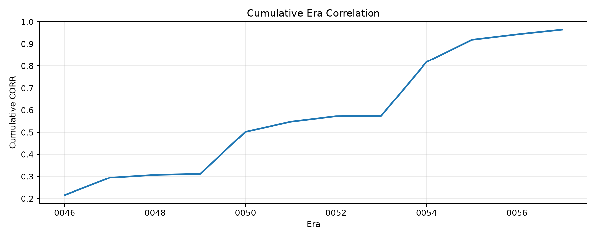

# numerai-quant-ml

A reproducible quant-ML research pipeline for Numerai-style cross-sectional prediction, with era-aware validation, tree ensembles, neutralization, cached reblending, and live submission support.

The repo does four main things:

1. downloads Numerai tournament data
2. runs era-aware backtests
3. trains and compares a few model families
4. generates live predictions and supports dry-run submission

It is built as a real applied ML workflow rather than a notebook-only project. The code is split into reusable modules, experiments are config-driven, long runs leave artifacts behind, and there is a clear path from backtest to live prediction.

This repo does not include staking logic, real secrets, profitability claims, or trading advice.

## What Numerai Is

Numerai is a data science tournament built around obfuscated market data. You get a large tabular dataset with anonymous features, a target to predict, and a live submission workflow. You never see the underlying tickers or raw market series.

That makes it a good setting for practicing:

- tabular modeling
- temporal validation
- ensembling
- robustness checks
- experiment tracking
- ML workflow engineering

## What This Repo Actually Does

The project started with a simple LightGBM baseline, then expanded into a small model-comparison workflow.

At this point it supports:

- LightGBM
- XGBoost
- CatBoost
- an MLX-based MLP experiment path for Apple Silicon
- post-prediction neutralization
- walk-forward backtesting by era
- cached reblending of saved fold predictions so you can test new ensemble weights without retraining base models

## Best Result So Far

The best medium-scale result so far came from a tuned CatBoost-heavy setup plus a reblend step over cached fold predictions.

- `ensemble mean_corr`: `0.081136`
- `ensemble sharpe_like`: `0.979448`
- `catboost_optional mean_corr`: `0.079392`
- `lgbm_main mean_corr`: `0.070495`

Those artifacts are copied into:

- [summary.json](docs/sample_artifacts/best_medium_reblend/summary.json)
- [model_leaderboard.csv](docs/sample_artifacts/best_medium_reblend/model_leaderboard.csv)
- [report.md](docs/sample_artifacts/best_medium_reblend/report.md)

That is still a backtest result, not evidence of live profitability.

This is a medium-scale experiment intended as a lightweight, reproducible sample. The curated sample run uses `12` validation eras. Separate benchmark configs expand the walk-forward window to `60` validation eras for broader evaluation.

### Sample Results

| Model | Mean CORR | Sharpe-like |
| --- | ---: | ---: |
| ensemble | 0.081136 | 0.979448 |
| ensemble_neutralized | 0.080321 | 0.966310 |
| catboost_optional | 0.079392 | 0.928660 |
| lgbm_main | 0.070495 | 1.045938 |



## Repo Layout

```text
configs/                  Experiment configs
data/                     Ignored raw data and predictions
models/                   Ignored saved model bundles
artifacts/                Ignored run outputs
notebooks/                EDA / scratch work
scripts/                  CLI entry points
src/numerai_quant/        Package code
tests/                    Unit tests
docs/                     Notes and curated sample artifacts
```

## Setup

```bash
cd numerai-quant-ml
uv sync --extra dev
cp .env.example .env
```

Optional extras:

```bash
uv sync --extra dev --extra xgboost
uv sync --extra dev --extra catboost
uv sync --extra dev --extra mlx
```

## Common Commands

Download only the training parquet:

```bash
uv run python scripts/download_data.py
```

Download train, validation, and live:

```bash
uv run python scripts/download_data.py --all
```

Smoke-test the pipeline:

```bash
uv run python scripts/backtest_walkforward.py --config configs/local_smoke.yaml
```

Run the original full backtest config:

```bash
uv run python scripts/backtest_walkforward.py --config configs/baseline.yaml
```

Run the medium config:

```bash
uv run python scripts/backtest_walkforward.py --config configs/portfolio_medium.yaml
```

Run the tuned CatBoost config that produced the strongest standalone model:

```bash
uv run python scripts/backtest_walkforward.py --config configs/portfolio_medium_catboost_v3.yaml
```

Run the stronger benchmark CatBoost config with `60` validation eras:

```bash
uv run python scripts/backtest_walkforward.py --config configs/strong_benchmark_catboost.yaml
```

Run the stronger benchmark MLX config with `60` validation eras:

```bash
uv sync --extra dev --extra mlx
uv run python scripts/backtest_walkforward.py --config configs/strong_benchmark_mlx_mlp.yaml
```

Reblend cached fold predictions without retraining:

```bash
uv run python scripts/reblend_walkforward.py \
  --config configs/portfolio_medium_catboost_v4.yaml \
  --source-run artifacts/<existing_run_dir>
```

Optimize blend weights from cached fold predictions:

```bash
uv run python scripts/reblend_walkforward.py \
  --config configs/strong_benchmark_catboost.yaml \
  --source-run artifacts/<existing_run_dir> \
  --optimize-weights \
  --objective mean_corr \
  --grid-step 0.05
```

Train the final saved bundle:

```bash
uv run python scripts/train_ensemble.py
```

Generate live predictions:

```bash
uv run python scripts/predict_live.py
```

Dry-run a submission:

```bash
uv run python scripts/submit_predictions.py data/predictions/live_predictions_<round>.csv
```

Actually submit:

```bash
uv run python scripts/submit_predictions.py data/predictions/live_predictions_<round>.csv --submit
```

Checks:

```bash
uv run --extra dev python -m pytest
uv run --extra dev ruff check .
```

## Reproducibility

Fresh environment:

```bash
uv sync --extra dev
```

Optional model extras:

```bash
uv sync --extra dev --extra catboost
uv sync --extra dev --extra xgboost
uv sync --extra dev --extra mlx
```

Reproduce the sample medium-scale artifact:

```bash
uv run python scripts/download_data.py --train-only
uv run python scripts/backtest_walkforward.py --config configs/portfolio_medium_catboost_v3.yaml
uv run python scripts/reblend_walkforward.py \
  --config configs/portfolio_medium_catboost_v4.yaml \
  --source-run artifacts/<source_run_dir> \
  --optimize-weights \
  --objective mean_corr \
  --grid-step 0.05
```

Run the stronger benchmark path:

```bash
uv run python scripts/backtest_walkforward.py --config configs/strong_benchmark_catboost.yaml
uv run python scripts/reblend_walkforward.py \
  --config configs/strong_benchmark_catboost.yaml \
  --source-run artifacts/<source_run_dir> \
  --optimize-weights \
  --objective mean_corr \
  --grid-step 0.05
```

## How Validation Works

The important part of the project is not the specific model class. It is the validation setup.

Numerai data comes with an `era` column. We treat that as a time-like grouping and backtest in a walk-forward way:

- train on earlier eras
- leave an embargo gap
- validate on later eras
- repeat for several folds

For each model and ensemble, the repo computes:

- era-wise Spearman correlation
- mean correlation
- correlation standard deviation
- a Sharpe-like `mean / std` score
- a simple drawdown-style diagnostic
- feature exposure diagnostics

This is still backtesting, but it is much more believable than a random split.

As a rule of thumb in this repo:

- `8-12` validation eras: smoke or development runs
- `12-24` validation eras: medium experiments and sample artifacts
- `40-80+` validation eras: stronger public-facing benchmarks

## What “Neutralization” Means Here

After blending predictions, the repo can neutralize the output against the most exposed features. This is a simple practical version of a common Numerai idea: reduce how strongly your prediction is tied to a small set of feature directions.

It is useful as an experiment, but it is not magic. Sometimes it helps, sometimes it just lowers the score.

## What The Artifacts Look Like

Each run writes a directory under `artifacts/` with files like:

- `summary.json`
- `fold_metrics.csv`
- `model_leaderboard.csv`
- `oof_predictions.parquet`
- `feature_exposure.csv`
- `report.md`
- plot images

Long runs also write partial outputs and checkpoints so interrupted jobs still leave something behind.

The reblend workflow reuses saved fold prediction checkpoints and regenerates ensemble metrics and plots from them. That is useful when you want to try new weights without paying to retrain every base model.

## What I Learned From The Experiments

The rough progression looked like this:

- LightGBM baseline was solid
- XGBoost improved the ensemble
- early CatBoost settings were bad
- a tuned CatBoost setup ended up beating the earlier XGBoost result
- aggressive feature filtering hurt performance
- reblending saved fold predictions was worth implementing because it sped up ensemble iteration immediately

That last point matters: some of the best improvement in this repo came from better experiment workflow, not just swapping models.

## Environment Variables

Submission uses:

- `NUMERAI_PUBLIC_ID`
- `NUMERAI_SECRET_KEY`
- `NUMERAI_MODEL_ID`

Put them in `.env`. The submission script refuses to run if they are missing.

## Assumptions

- dataset download uses the common `numerapi.download_dataset("<version>/<file>")` pattern
- default dataset version is still `v5.2` in the configs here
- the project is aimed at Python `3.12`
- optional model families stay behind `uv` extras so a fresh clone stays easy to install

## Limitations

- everything here is still backtesting
- the neutralization logic is intentionally simple
- no staking or capital allocation layer is included
- no live monitoring dashboard is included
- the neural model lane is still experimental

## Next Things I’d Add

- a small experiment registry instead of just artifact directories
- cleaner cached prediction reuse across more experiment types
- a more serious neural tabular model if the MLX MLP shows promise
- live round tracking and historical submission monitoring
